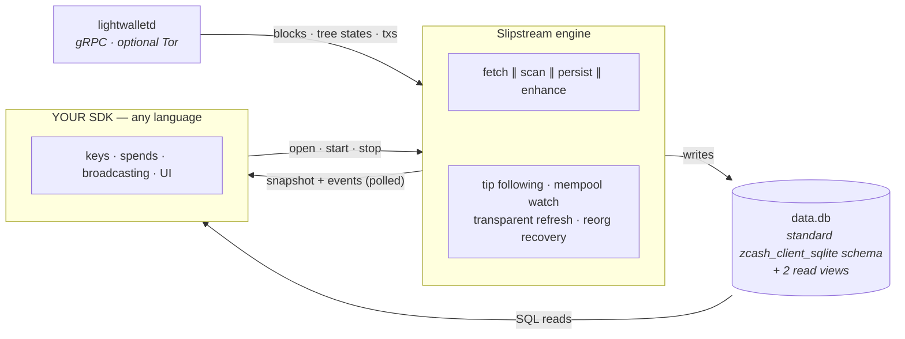

# Hosting Slipstream — the crate consumer's guide

This document is for someone building **their own wallet SDK** — in Rust, Kotlin, Python,
Go, C#, anything with a C FFI — who wants Slipstream to do the syncing. It answers one
question end to end: **what do I call so that a standard Zcash wallet database
(`data.db`) fills with this wallet's data — and how do I read the results correctly.**

(If you are building an iOS/macOS app on the Swift SDK, you want the higher-level
integration guide in the SDK repo instead. This
document is one level below that: the contract that guide is built on.)

---

## 1. The mental model

Slipstream is the **read side** of a Zcash light wallet, packaged as an engine:



- **The engine owns:** transport (concurrent block streams; isolated Tor circuits for the
  privacy-relevant calls), scanning (trial decryption, note commitment trees), persistence
  (the standard `zcash_client_sqlite` schema — migrations run automatically), transaction
  enhancement (full tx data + memos), 0-conf mempool detection, transparent UTXO refresh,
  chain-tip following, reorg recovery, retry policy for transient network failure, and
  **wallet provisioning facts** (`restore_anchor`).
- **The host owns:** keys (seeds, derivation, signing — they **never** enter the engine;
  sync runs on viewing capability), building/broadcasting spends, and the UI. The spend
  side of your SDK is the standard librustzcash flow (`zcash_client_backend` proposal →
  create → submit against a lightwalletd) — it operates on the **same `data.db`** the
  engine fills, so the two sides compose with no glue.
- **The interface is deliberately poll-based** — a snapshot struct you read on a timer,
  a bounded event ring you drain, and SQL you query. No callbacks cross the boundary
  (callbacks across FFI are a reentrancy/threading trap in every binding language).

The engine's guiding contract, which everything below elaborates:
**the numbers the engine exports are already correct at every phase — render them; never
re-derive them.** (Progress, the recovery flag, balances, tip-freshness: each exists
because some host once computed its own version and shipped a bug.)

## 2. Two ways in

- **§3 — Rust host:** depend on `zodl-slipstream` and drive `run_session` directly.
  ~100 lines. The `slipstream watch` CLI in this repo is the complete reference.
- **§4 — Any-language host over the C ABI:** call the `zcashlc_slipstream_*` functions.
  Today those live in `libzcashlc` (the Zcash Swift SDK's Rust library, which links
  `zodl-slipstream`); they are self-contained (~600 lines over `zodl-slipstream`'s
  `ffi_handle` module) and lift directly into your own cdylib if you don't want the rest
  of `libzcashlc`. Everything in §5–§9 (snapshot, events, SQL, provisioning, rules)
  applies identically to both.

## 3. Rust host — `zodl-slipstream` directly

### 3.1 Prerequisites

```toml
[dependencies]
zodl-slipstream = "0.1"
tokio = { version = "1", features = ["rt-multi-thread", "macros", "sync", "time"] }
```

You need: a filesystem path for `data.db` (the engine creates the file and runs schema
migrations itself — you do NOT need to initialize anything), a lightwalletd endpoint, and
**an account in the wallet** — one of:

- **Hand the engine a UFVK** (view-only import): pass `account: Some((ufvk_string,
  birthday_height))` in the session config. On the first pass the engine imports it
  (keyless — this is the only account-creation path the engine offers, and it no-ops if
  any account already exists). Derive the UFVK from the seed in YOUR code
  (`zcash_keys`) — the seed stays with you.
- **Or create the account yourself** with `zcash_client_sqlite` (seed-based
  `create_account`, or `import_account_ufvk` with a `recover_until` height for proper
  restore semantics — see §8) before starting the engine, and pass `account: None`.

### 3.2 The session

```rust
use std::sync::{Arc, Mutex};
use zodl_slipstream::{
    EngineConfig, Endpoint, Network, Progress, SessionConfig, SessionReporter,
    ffi_handle::{self, SyncState, FfiSlipstreamEvent, derive_snapshot, spawn_supervised},
    session::run_session,
};

let config = SessionConfig {
    engine: EngineConfig::new(
        Network::MainNetwork,
        "/path/to/data.db".into(),
        Endpoint { host: "zec.rocks".into(), port: 443, tls: true },
    ),
    // .scaled_for_device_memory(total_bytes)  // derates budgets on <3 GiB devices
    account: Some((ufvk_string, 2_400_000)),   // or None if you created the account
    tor: None,                                 // or Some(TorSessionConfig { dir, dangerously_trust_everyone })
};

// The reporter is the shared surface the engine writes and you poll:
let reporter = SessionReporter {
    progress: Arc::new(Progress::default()),
    state: Arc::new(Mutex::new(SyncState::Idle)),
    events: Arc::new(Mutex::new(Vec::new())),
};

// One pass-lock per wallet DB — serializes overlapping passes across restarts.
let pass_lock = Arc::new(tokio::sync::Mutex::new(()));

// OPTIONAL but recommended: seed the snapshot from persisted wallet state BEFORE the
// first pass, so a relaunched half-done restore reports its true position and recovery
// flag from the very first poll ("truthful from open" — see §5).
if let Ok(session) = zodl_slipstream::wallet_session::WalletSession::open(
    Network::MainNetwork, std::path::Path::new("/path/to/data.db"))
{
    let _ = zodl_slipstream::scheduler::seed_progress_from_wallet(&reporter.progress, &session);
}

// Spawn under the supervisor: a panicking pass becomes SyncState::Error + a tag-4 event,
// never a silent hang. Keep the AbortHandle — aborting it IS "stop".
let abort = spawn_supervised(
    &runtime,
    run_session(config, reporter.clone(), pass_lock.clone()),
    reporter.state.clone(),
    reporter.events.clone(),
);
```

`run_session` is the whole lifecycle: (optional Tor bootstrap →) initial sync pass with
transient-failure retries → then it **stays live**, following the chain tip (jittered
10–30 s probes) and watching the mempool, until you `abort()` it. You never re-poke it.

### 3.3 The poll loop (this is your entire integration)

```rust
loop {
    tokio::time::sleep(std::time::Duration::from_secs(2)).await;

    let state = *reporter.state.lock().unwrap();
    let snap  = derive_snapshot(&reporter.progress, state);   // cheap; call every tick

    let drained: Vec<FfiSlipstreamEvent> =
        { let mut ring = reporter.events.lock().unwrap(); std::mem::take(&mut *ring) };

    render_progress(snap.progress_permille, snap.is_recovering, snap.state);

    // The one transaction rule (§5.4): the set changed → re-query and publish.
    if snap.tx_set_version != last_version || recovering_flag_flipped {
        last_version = snap.tx_set_version;
        publish(read_visible_transactions(&db_path, snap.is_recovering == 1));  // §7
    }
}
```

Stopping: `abort.abort()` (the state stays whatever you set it to — set `Idle` yourself).
Restarting after an error or a foreground event: spawn `run_session` again with the same
reporter and pass-lock — the scan position is durable in `data.db`; nothing restarts from
scratch. To **watch and re-render only**, this loop is the whole host — the CLI's `watch`
command (`cli/src/main.rs`) is exactly this in ~200 lines and renders balances and
transactions with **zero wallet math of its own**; treat it as executable documentation.

## 4. Any-language host — the C ABI

Nine functions. `SlipstreamHandle` is opaque; snapshot is returned **by value**.

| Function | What it does |
|---|---|
| `zcashlc_slipstream_open(db_path, path_len, host, host_len, port, use_tls, network_id, total_memory_bytes) → *Handle` | Allocates the handle (its own tokio runtime + atomics + event ring), runs DB schema migrations, installs the read views, and **seeds the snapshot from persisted wallet state** (truthful from open, §5). `network_id`: 1 = mainnet, 0 = testnet. `total_memory_bytes`: pass physical RAM or 0. Null on failure. |
| `zcashlc_slipstream_start(handle, ufvk, ufvk_len, birthday, tor_dir, tor_dir_len) → bool` | Spawns the session (initial pass → follow + mempool). `ufvk` null/0 = keyless (account already exists); non-null = view-only import on first pass. `tor_dir` non-empty = engine-owned Tor for the identifying calls. Call again after `stop` to restart (aborts any in-flight pass first, safely). |
| `zcashlc_slipstream_stop(handle) → bool` | Cancels the sync task. Handle stays usable (snapshot/drain still work). |
| `zcashlc_slipstream_snapshot(handle) → FfiSlipstreamSnapshot` | The poll read (§5). By value, cheap, call every tick. |
| `zcashlc_slipstream_drain_events(handle, buf, buf_len) → usize` | Atomically drains up to `buf_len` events (§6) into your buffer. Drain every tick (even if you ignore the contents) so the 64-slot ring never warns. |
| `zcashlc_slipstream_wallet_summary(handle, confirmations_policy) → *FfiWalletSummary` | **Phase-resolving balances** (§7.2): recovery-safe values while restoring, upstream summary otherwise. Internally cost-rationed — safe to call every tick. Free with `zcashlc_free_wallet_summary`. |
| `zcashlc_slipstream_notify_tx_change(handle) → bool` | Host poke after YOU stored a transaction (post-broadcast): bumps `tx_set_version` (+ a tag-5 event) so your own poll loop picks it up uniformly. |
| `zcashlc_slipstream_restore_anchor(host, host_len, port, tls, network_id, intent, birthday, fallback_checkpoint_height, tor_dir, tor_dir_len) → *FfiRestoreAnchor` | Handle-less wallet-provisioning facts (§8). Free with `zcashlc_slipstream_free_restore_anchor`. |
| `zcashlc_slipstream_free(handle)` | Drops the handle (cancels everything, drops the runtime). |

Threading rules: **never pass one handle to two FFI calls concurrently** (serialize on
your side — an actor, a mutex, a single dispatch queue). All calls are synchronous;
`open` does milliseconds of DB work, `wallet_summary`'s first call walks the wallet
(one-time), `restore_anchor` blocks for one network round-trip (hop it off your UI
thread).

## 5. The snapshot — field by field

```c
typedef struct {
    uint64_t chain_tip;          // tip as known to the wallet (persisted tip from open; live once syncing)
    uint64_t fetched_blocks;     // per-pass counters …
    uint64_t scanned_blocks;
    uint64_t enhanced_txs;       // monotonic per handle
    uint64_t current_range_end;
    uint8_t  state;              // 0 idle · 1 syncing · 2 error · 3 done(following)
    uint64_t pass_total_blocks;
    uint8_t  spendable_hint;     // 1 once the recent (chain-tip) range has scanned — "spend before sync"
    uint64_t ranges_completed;   // monotonic per handle
    uint8_t  is_recovering;      // §5.2
    uint16_t progress_permille;  // §5.1 — THE progress value, 0..=1000
    uint32_t stalled_seconds;    // §5.3
    uint8_t  tip_fresh;          // §5.5
    uint64_t tx_set_version;     // §5.4 — THE transaction signal
} FfiSlipstreamSnapshot;
```

**The snapshot is truthful from `open()`** — hosts must not compensate. Before the first
network byte, `is_recovering`, `progress_permille`, `chain_tip` and `spendable_hint` are
seeded from the persisted wallet, so a relaunch mid-restore reports "restoring, at 34%"
on your very first poll. Do not build warm-up caches, "hold last known value" layers, or
first-N-seconds special cases; they solve a problem that no longer exists and re-create
ones that were already fixed.

### 5.1 `progress_permille` — render it, never derive it
0..=1000. Guarantees: **never regresses** while the handle lives; a synced wallet's
catch-up starts ~1000 (no 0% flash); an interrupted restore **resumes at its true
position**; when the scan scope *expands* (an account with an older birthday is imported,
a rewind re-grows the queue) the floor **re-baselines itself** so the re-scan reads as a
genuine 0→100% climb. Every height-ratio formula a host invents is wrong in at least one
of those cases — that is why this field exists. `state == 3` forces 1000.

### 5.2 `is_recovering` — the restore flag
1 while queued scan work remains below the account's `recover_until` height (a restore or
new-account backfill — the window in which naive balance/history reads are misleading).
Derived from the database (survives kills; correct from open), recomputed every scheduler
round, and **force-released on terminal states** — a dead pass can never wedge your
"Restoring…" UI. Use it to label the phase and to key the visibility rule in §7.1. Never
persist your own restoring flag.

### 5.3 `stalled_seconds`
Seconds the engine has gone without forward progress, while `state == 1`; 0 otherwise. It
is the longer of two spans. The first runs from the last forward progress: any counter
moving, the start of a pass, data arriving from the server during the pass (every streamed
block and every metadata message, direct or over Tor), or a unit of local work completing
(a persisted chunk, the range-end tree build). So a pass whose data keeps arriving is not
reported by the first span. When a fetch worker gives up with blocks still undelivered,
the engine notes the lowest block it had not yet handed to the scanner. The pass then
fails and is retried — or, when wire failover is armed, fails over to another endpoint
instead; either way, the give-up counts. Once the download has given up twice at that same
block, with no more than ten minutes between give-ups, the second span runs from the first
of them, whatever the retried passes do meanwhile. It lasts until a later download hands
that block to the scanner, a pass completes, or a new session starts. A server that cannot
deliver a block range is therefore reported as stalled, instead of being retried out of
the host's sight. A pass that fails before its download starts (for example, with no
network) never counts, nor does a fetch that failed after delivering every block. The
engine supplies the fact; the host owns the policy (the Swift SDK restarts a pass that
stays stalled for 120 s, at most three times per engine handle, and reports each restart
and the final give-up).

### 5.4 `tx_set_version` — the one transaction rule
A monotonic counter that bumps **exactly when the stored transaction set changes**: a
transaction scanned/enhanced, a pending one mined or expired, a mempool 0-conf hit, a
restore linkage resolving, or your own `notify_tx_change` poke after a broadcast.

> **Host rule (the whole thing):**
> `snapshot.tx_set_version != last_seen  OR  my recovery filter flipped scope`
> `→ re-query transactions (§7.1) and publish to the UI; remember both.`

It is snapshot-carried and cumulative, so it cannot be "lost" the way queue events can —
do not build counter-watching or event-sniffing heuristics on top. (The second clause is
yours because the *visibility filter* in §7.1 is host policy: when `is_recovering` flips,
the visible list changes with no engine write.)

### 5.5 `tip_fresh` — the spendable-display mask
1 once the **current run** has refreshed the wallet's chain tip (or completed a pass);
survives stop→start hops shorter than 120 s. While 0, "spendable" would be a claim about
a chain state this session hasn't verified — display those funds as *pending
spendability* instead (shift spendable → pending in your balance rendering; never applied
while `is_recovering` = 1, where balances are recovery-safe by construction, §7.2).

## 6. The event ring

`drain_events` yields `{ tag: u8, value: u64 }`:

| tag | Meaning | value |
|---|---|---|
| 1 | SyncStarted | 0 |
| 2 | SyncProgress (pacing) | scanned blocks |
| 3 | SyncDone (one pass finished) | transactions stored |
| 4 | SyncError | 1 = pass failed (after internal transient retries) · 2 = task panicked (supervisor-converted) |
| 5 | FoundTransactions | 0 |

The ring holds 64 events; on overflow it evicts the oldest *droppable* (tags 1–2) first —
done/error/found survive. Treat events as **doorbells, not payloads**: state and progress
come from the snapshot, data comes from SQL. A minimal host can ignore every tag and run
purely on the snapshot (`state == 2` covers errors; `tx_set_version` covers tag 5) — but
must still drain the ring each tick.

## 7. Reading the results — the SQL surface

After (and during) sync, `data.db` is a **standard `zcash_client_sqlite` wallet
database** — accounts, transactions, notes, UTXOs, scan queue. Read it with the
`zcash_client_sqlite`/`zcash_client_backend` APIs from Rust, or with plain SQL from any
language (the schema ships stable views like `v_transactions`). Slipstream adds two
**versioned, read-only views** and two documented host rules:

### 7.1 Transaction visibility — `slipstream_v_tx_reconciled`
`(txid, reconciled)` per wallet transaction. `reconciled = 0` means the transaction has an
observed shielded spend whose source note hasn't been scanned yet — exactly the
restore-window case where a self-send's change reads as a phantom "+received". The rule:

> **visible = reconciled OR NOT is_recovering**

During recovery, hold back the unreconciled rows (each reveals itself the moment its
history links — genuine receives appear immediately, mid-restore). Outside recovery show
everything: on a synced wallet a flagged row is real money and hiding it is the
"vanishing transaction" bug.

### 7.2 Balances — never over-show
Naive balance math **over-counts during a restore** (a received note is counted before
the spend that consumed it is scanned). Two equivalent ways to get phase-correct values:

- **C ABI:** call `zcashlc_slipstream_wallet_summary` — it resolves the phase internally
  (recovery-safe values while `is_recovering`, the upstream summary otherwise) and
  rations its own cost. Then apply the §5.5 display mask.
- **Rust / raw SQL:** while `is_recovering`,
  `SELECT account_uuid, balance_zat FROM slipstream_v_recovery_balance` — the sum of
  *fully-reconciled* transaction deltas: climbs monotonically to the true total, can
  momentarily under-show, **never over-shows**. Otherwise use the standard
  `WalletDb::get_wallet_summary`.

Never sum notes/transactions yourself for a headline balance, and never serve a cached
balance across the restore phase.

### 7.3 Concurrency with the engine
The database runs in WAL mode (the engine sets it): your readers run concurrently with
the sync writer. Set `busy_timeout` (≥5 s) on every connection you open; keep your
connections read-only.

## 8. Provisioning — `restore_anchor`

Creating or restoring a wallet needs two chain facts *before* the first pass; the engine
owns the policy so every host provisions identically (`intent`: 1 = restore, 0 = new):

- **Restore(birthday):** returns `height` = the current chain tip, to store as the
  account's `recover_until`. This is what makes the `[birthday…tip]` backfill register as
  a *recovery* (§5.2, §7). **Offline fallback built in:** an unreachable server yields
  `max(your bundled checkpoint height, birthday + 1)` — a restore must never be
  provisioned with a NULL `recover_until` (it would silently masquerade as a new wallet
  and disable every recovery guarantee).
- **New:** returns a reorg-safe recent tree state (`tip − 100`, floored at Sapling
  activation) as `{height, treestate protobuf bytes}` to create the account from; offline
  ⇒ height 0/no treestate, keep your bundled checkpoint.

Pass the same `tor_dir` you give `start` when your user enabled Tor — these fetches are
identifying (they reveal birthday interest). A requested-but-failed Tor bootstrap
resolves **offline**, never via a silent direct connection. Rust hosts call
`zodl_slipstream::anchor::restore_anchor` / `offline_anchor` directly.

Feed the result into account creation (your `zcash_client_sqlite` calls, or
`ufvk`+birthday at `start`). Keys still never cross.

## 9. Host responsibilities — the contract in one list

**You must:**
- Poll snapshot + drain events on a steady tick (1–2 s) while the UI is visible.
- Serialize all calls on one handle; `stop()` on background, `start()` on foreground
  (position is durable — restarts are cheap and resume).
- Apply the two documented rules verbatim: visibility (§7.1) and the tx re-query rule
  (§5.4); use `busy_timeout` on your DB connections (§7.3).
- Treat `state == 2` as "offer retry" (call `start` again). Transient network trouble
  never reaches you — it's retried inside.
- Keep seeds/spending keys on your side of the boundary, always.
- Satisfy the AGPL for whatever you build on the engine, or hold a commercial license
  (§11) — settle this before you ship, especially for App Store distribution.

**You must never:**
- Compute progress from heights, smooth/clamp the reported progress, or add warm-up
  holds (§5, §5.1).
- Re-derive balances from notes/transactions or cache one across a restore (§7.2).
- Persist your own "is restoring" flag (§5.2) or invent an init-mode enum (§8 derives it).
- Build event-loss heuristics — the version counter is the loss-proof signal (§5.4).
- Fall back to a direct connection when the user asked for Tor (§8; the engine won't
  either).

## 10. What Slipstream deliberately does NOT do

Key management and derivation, transaction construction/signing/broadcasting, fee/UX
policy, exchange rates. For a full wallet SDK you add those with standard published
crates (`zcash_keys`, `zcash_client_backend`, a lightwalletd submit call) — all of them
operate on the same `data.db` slipstream maintains. The division is strict by design:
the engine can be audited, fuzzed and swapped as a pure sync component, and your SDK
keeps custody exactly where it already is.

## 11. Licensing — the other host responsibility

Slipstream is licensed under the **GNU Affero General Public License, version 3 only**
(`AGPL-3.0-only`). See `LICENSE`, shipped in the crate.

Hosting Slipstream is not mere aggregation: an SDK that links the engine and calls the
API in this document is a work based on Slipstream, and the AGPL governs the whole of
it. Concretely, if you convey your SDK or an application built on it to anyone:

- The **complete corresponding source** of that work must be offered to every recipient
  under the AGPL — including, per section 13, users who interact with it only over a
  network and never receive a copy.
- Keeping your source private, or licensing your SDK under other terms, is not
  available under the AGPL. This is a condition on conveying, not on use: private
  in-house deployment and modification carry no publication obligation.

**Apple App Store and equivalent channels.** App Store terms are widely held to be
incompatible with the AGPL's conditions. No section 7 additional permission is granted
to AGPL licensees for such channels — see `LICENSE-EXCEPTIONS.md` §2. Official Zodl
builds distributed there are released by Znewco under separate terms as copyright
holder; that permission does not extend to you. **If your SDK is destined for the App
Store, the AGPL is not a viable path** — resolve licensing before you build against
this document, not after.

**Commercial licensing.** If any of the above does not fit your project, Slipstream is
dual-licensed and commercial terms are available from Znewco, Inc. — see
`COMMERCIAL-LICENSE.md`. Use under the AGPL requires no registration, notification, or
fee.

Nothing here modifies the AGPL or grants any permission beyond it; `LICENSE` and
`LICENSE-EXCEPTIONS.md` govern. The dependency crates named in §10 (`zcash_keys`,
`zcash_client_backend`, and the rest of the librustzcash family) are separately licensed
under MIT/Apache-2.0 by their own copyright holders and are not affected by this section.

---

*Companions: `README.md` (what/why + versioning map) · `REVIEWING.md` (module map for
protocol engineers) · `cli/src/main.rs` `watch` (the reference host: everything in this
document, running, in ~200 lines).*
